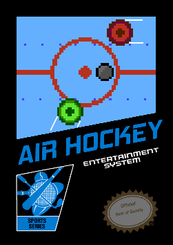
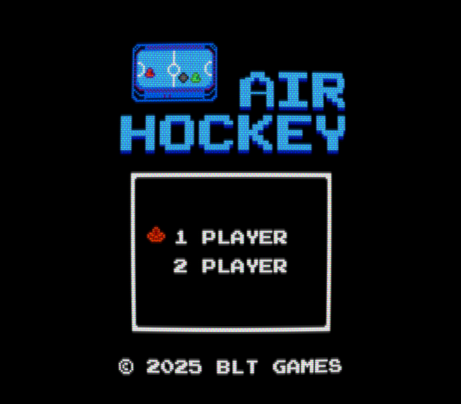

# Air Hockey - NES

A fast-paced air hockey game for the Nintendo Entertainment System, written in [NESFab](https://pubby.games/nesfab.html). It targets original NROM-compatible NES hardware in the style of the original "black box" games.

[Download the ROM on itch.io](https://bthacker.itch.io/air-hockey-nes-black-box).

## Screenshots



## Features

- One- or two-player matches with selectable first-to-3, 5, or 7 scoring.
- Easy, Normal, and Hard AI difficulty settings.
- Arcade, Space, and Retro rink themes with six mallet colors.
- Physics-based collisions, goal replays, and attract mode.
- 60 FPS presentation with five physics substeps per frame.

## Controls

| Input | Gameplay | Menus |
| --- | --- | --- |
| D-pad | Move mallet | Move selection |
| B | Boost / stronger hit | Confirm |
| Start | Pause | Confirm |
| A | — | Go back |

## Building

NESFab 1.8 is required. Place the NESFab executable and source distribution in `nesfab/` as described in [nesfab/README.md](nesfab/README.md).

- Windows: run `build.bat`.
- macOS: install Wine and Mesen, then run `bash build_macos.sh`.
- macOS debug build: run `bash build_macos.sh debug` to generate Mesen labels (`air_hockey_rev1A.mlb`).

The build creates `air_hockey_rev1A.nes`.

## Development

- Check formatting: `bash scripts/format_fab.sh --check`
- Apply formatting: `bash scripts/format_fab.sh --write`
- NESFab documentation and coding guidance: `nesfab/source1.8/doc/doc.adoc`

## Project layout

```text
src/            Game, menu, physics, AI, replay, and debug code
chr/            Sprite and background graphics
nametables/     Title screen and rink layouts
audio/          Music and sound effects
nesfab/         Locally supplied NESFab compiler and source distribution
air_hockey.cfg  NESFab build configuration
```

## License

The game is licensed under the [MIT License](LICENSE). NESFab is GPL-3.0; its standard library and examples use the Boost Software License 1.0.

## Credits

- Programming, design, and game art: Brandon Thacker ([GitHub](https://github.com/bthacker))
- Music and sound effects: [Grayson Solis](https://graysonsolis.com/)
- Art consulting and cover art: [@grigoreen](https://www.instagram.com/grigoreen/)
