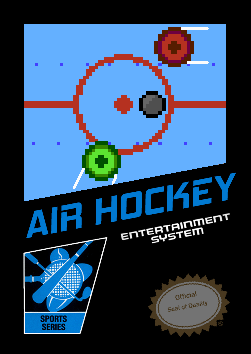
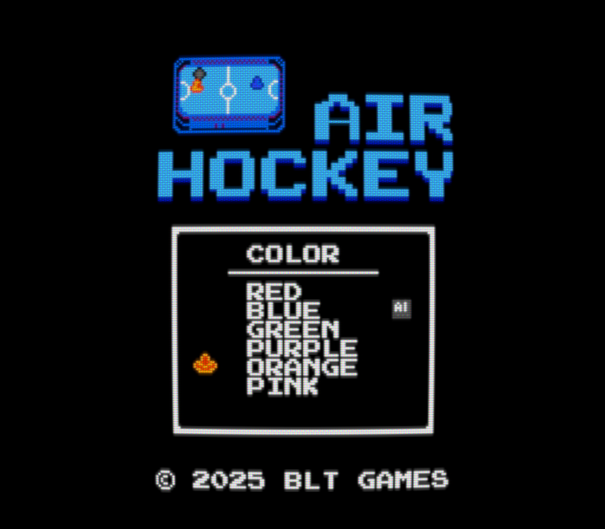

# Air Hockey - NES

A classic air hockey game built for the Nintendo Entertainment System (NES) using the [NESFab](https://pubby.games/nesfab.html) programming language. Download the rom [HERE](https://bthacker.itch.io/air-hockey-nes-black-box) from itch.

 Experience fast-paced arcade action with authentic physics, multiple themes, and intelligent AI opponents. This game is inspired by the NES "Black Box" titles and is designed to run on the original NROM mapper which was common for those early games. This project is open source with the hope that others jump into the world of development for the NES. This was an incredibly fun project to complete. Total development time was < 4 weeks.

## Table of Contents
- [Screenshots](#screenshots)
- [Features](#features)
- [Controls](#controls)
- [Building the Game](#building)
- [Project Structure](#project-structure)
- [Technical Details](#technical-details)
- [Potential Future Enhancements](#potential-future-enhancements)
- [License](#license)
- [Credits](#credits)
- [Known Issues](#known-issues)

## Screenshots






## Features
### Gameplay
- **Authentic Air Hockey Physics**: Realistic puck movement with friction simulation and advanced collision detection
- **Two-Player Support**: Play against a friend or challenge the AI
- **Intelligent AI Opponent**: Advanced AI with multiple behavioral states (defensive, aggressive, counter-attack, neutral, backoff)
- **Score Tracking**: First to 7 goals wins (standard air hockey rules)
- **Replay System**: Watch the last 2 seconds of gameplay in slow motion after each goal

### Visual Themes
- **Arcade Theme**: Standard air hockey table in a retro arcade
- **Space Theme**: Futuristic space setting with animated starfield background
- **Retro Theme**: Retro, even for NES standards

### Customization
- **Player Colors**: Choose from 6 different color palettes for each mallet
- **Arcade Theme**: Standard air hockey table in a retro arcade
- **Space Theme**: Futuristic space setting with animated starfield background
- **Retro Theme**: Retro, even for NES standards


### Technical Features
- **High-Performance Physics**: 300 FPS effective physics simulation (5 ticks per NMI)
- **Optimized Rendering**: Efficient sprite management and background rendering
- **Audio System**: Music and sound effects using PUF1 (NESFAB) audio engine
- **Memory Management**: Smart memory usage with circular buffer replay system
- **Visual Effects**: Smooth fades, flashing on goal, replay
- **Attract Mode**: Watch the AI play the game

## Controls
### Gameplay
- **D-Pad**: Move mallet 
- **B Button** Boost / double speed (use it almost always, let off for less puck reaction)
- **Start**: Pause / Unpause game

### Menu Navigation
- **D-Pad Up/Down**: Navigate menu options
- **Start/B**: Confirm selection
- **A**: Go back (when available)

## Building

### Info
- Game is built with the library [NESFab](https://pubby.games/nesfab.html)
- Windows (tested on Windows 10/11)
- M3 Macbook Pro (via WINE)
- NESFab compiler v1.8  [nesfab github](https://github.com/pubby/nesfab) [release](https://github.com/pubby/nesfab/releases/tag/v1.8)
- Emulator of choice, tested Mesen, Nestopia, Fceux
- Will work on any flash cart on original hardware

### Tools Used in Development
 - [NESFab](https://github.com/pubby/nesfab)
 - VSCode
 - [NEXXT studio](https://frankengraphics.itch.io/nexxt)
 - famitracker, [dn-famitracker](https://github.com/Dn-Programming-Core-Management/Dn-FamiTracker)
 - Aseprite


## Project Structure

```
nes_air_hockey/
├── src/                          # Source code
│   ├── air_hockey_main.fab       # Main menu and initialization
│   ├── air_hockey_game.fab       # Core game logic
│   ├── air_hockey_constants.fab  # Game constants and configuration
│   ├── air_hockey_data.fab       # Graphics, audio, and palette data
│   ├── air_hockey_drone.fab      # AI opponent logic
│   ├── air_hockey_replay.fab     # Replay system
│   ├── air_hockey_helpers.fab    # Utility functions
│   ├── air_hockey_structs.fab    # Data structures
│   └── air_hockey_space_bg.fab   # Space theme background handling
├── chr/                          # CHR ROM data
│   ├── sprites.png               # Sprite tiles
│   └── bg.png                    # Background tiles
├── nametables/                   # Background layouts
│   ├── air_hockey_arcade.nam     # Arcade theme
│   ├── air_hockey_space.nam      # Space theme
│   ├── air_hockey_retro.nam      # Retro theme
│   └── air_hockey_main.nam       # Title screen
├── audio/                        # Audio files
│   ├── music.txt                 # Music data
│   ├── sfx.nsf                   # Sound effects
│   └── sfx.txt                   # Sound effects
│
├── marketing/                   # Promotional materials
├── nesfab-master/               # [NESFab](https://github.com/pubby/nesfab) compiler and libraries, download from link
└── build.bat                    # Sample Build script
```


## Technical Details
### Physics Engine
- **High-Resolution Physics**: 300 FPS effective simulation for pixel perfect collisions with fast moving objects
- **Collision Detection**: Precise circle-to-circle collision with mallet and puck
- **Friction Simulation**: Realistic ice-like surface with configurable friction
- **Boundary Physics**: Proper wall bouncing with energy conservation

### Performance
- **60 FPS Gameplay**: Smooth, consistent 60fps frame rate even with 300fps physics, replays etc, scrolling bg etc
- **Memory Efficient**: Smart use of NES's limited 2KB RAM (however, it uses almost 1KB just for the replay system!)

### Audio
- **Background Music**: Title track
- **Sound Effects**: 
  - Mallet hits
  - Goal scoring
  - Menu navigation
  - Collision sounds
  - Violation


### AI System
The AI opponent features sophisticated behavior:
- **State Machine**: 5 different AI states (defensive, aggressive, counter-attack, neutral, backoff)
- **Predictive Movement**: AI predicts puck trajectory and positions accordingly
- **Realistic Limitations**: AI has reaction delays and movement constraints
- **Anti-Stuck Logic**: Prevents AI from getting stuck in repetitive patterns


## Potential Future Enhancements
Potential features for future versions:
- Tournament mode
- Additional themes
- Power-ups
- Custom difficulty settings
- Additional human like AI behavior

## License
This project is open source. The NESFab compiler is licensed under GPL 3.0, while the standard library and examples use the Boost Software License 1.0.

## Credits
- Programming & Design / Game Art - Brandon Thacker [github](https://github.com/bthacker) | discord: imex7315
- Music & Sound Effects - Grayson Solis [website](https://graysonsolis.com/)
- Art Consulting, Cover Art  - @grigoreen [website](https://www.instagram.com/grigoreen/)

## Known Issues
- The puck can react unexpectedly in certain interactions with the mallet
- The collision detection for passing into the goal could be better
